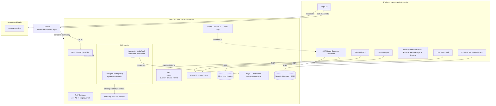
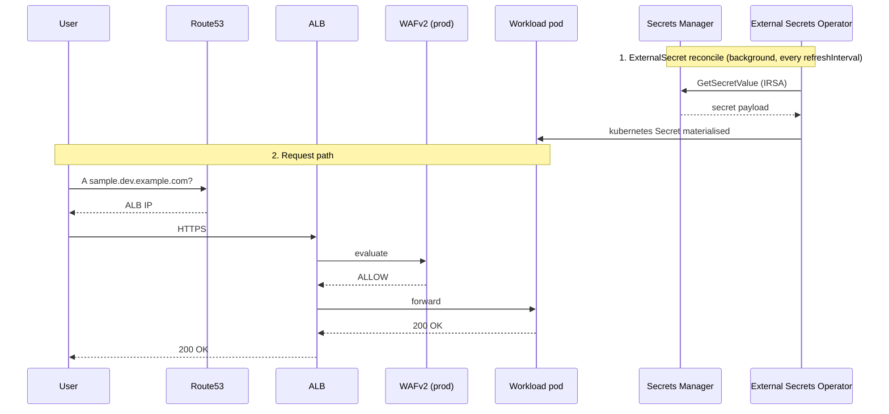

# Architecture

The platform is one EKS cluster per environment, three environments
(`dev`, `staging`, `prod`), each provisioned by the same Terraform modules
parameterised through Terragrunt. Once Terraform brings up the cluster
plus ArgoCD, ArgoCD takes over and reconciles every other component from
this repository.

## Component map

## Data flow at request time

## Repository → cluster mapping

| Repo path | Owner | Reconciled by |
|---|---|---|
| `terraform/modules/*` | Platform | Terraform via Terragrunt |
| `terraform/live/<env>/*` | Platform | Terragrunt CI |
| `kubernetes/argocd/*` | Platform | ArgoCD (root app-of-apps) |
| `kubernetes/platform/<env>/*` | Platform | ArgoCD `platform` ApplicationSet |
| `kubernetes/workloads/<env>/<tenant>/*` | Tenant + platform review | ArgoCD `workloads` ApplicationSet |
| `charts/*` | Platform (with tenant input) | Helm via ArgoCD |
| `apps/*` | Service team | Built and pushed by GitHub Actions |
| `docs/*` | Platform | None — humans only |

## Why these choices

The big four decisions are recorded as ADRs in [`docs/adr/`](adr/):

- [ADR-0002: EKS over ECS](adr/0002-choose-eks-over-ecs.md)
- [ADR-0003: Karpenter over Cluster Autoscaler](adr/0003-karpenter-over-cluster-autoscaler.md)
- [ADR-0004: ArgoCD over Flux](adr/0004-argocd-over-flux.md)
- [ADR-0005: Terragrunt over workspaces](adr/0005-terragrunt-over-workspaces.md)
- [ADR-0006: GitHub OIDC over static keys](adr/0006-github-oidc-over-static-keys.md)
- [ADR-0007: External Secrets Operator over CSI](adr/0007-external-secrets-operator.md)
- [ADR-0008: Self-host Prom/Loki](adr/0008-self-hosted-observability.md)
